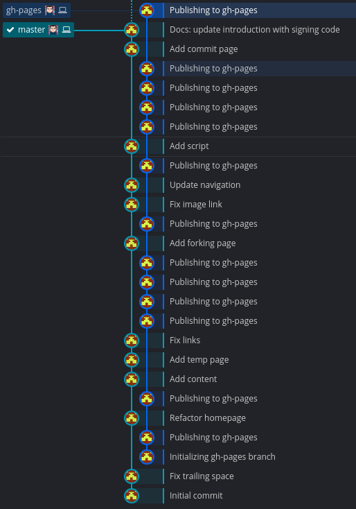

# Organizing Repos with Branches

At the core, the central repo holds two main branches with an infinite lifetime and possibly several supporting branches that only last for a specific purpose.


## The Main Branches

- master
- develop

We consider ```origin/master``` to be the main branch where the source code always reflects a *production-ready* state. It will always compile, should have most if not all known bugs removed, and function as intended.

We consider ```origin/develop``` to be the main branch where the source code reflects a state with the *latest delivered development changes for the next release*. This is where the code will always compile but runtime errors or bugs might exist and are discovered. The supporting branches are created from the ```develop``` branch to either add features, fix bugs, or specialized release branches.

Your changes should be made in your own branch supporting branch from the ```develop``` branch and your pull request will be made into the ```develop``` branch. More of that will be covered in the [Pull Request](#) section.

## Supporting Branches

There are several different types of branches with their own unique uses. Below are a few of the most common ones but they may be more:

- Feature branches
- Release branches
- Hotfix branches
- GitHub Pages branch
- Docs branch

Each of these branches have a specific purpose and are bound to strict rules as to which branches may be their originating branch and which branches must be their merge targets. We will walk through them in a minute.

!!! info
    By no means are these branches “special” from a technical perspective. The branch types are categorized by how we use them. They are of course plain old Git branches.

### Feature Branches

May branch off from: ```develop```  
Must merge back into: ```develop```  
Branch naming convention: anything except ```master```, ```develop```, ```release-*```, or ```hotfix-*```  

Feature branches (or sometimes called topic branches) are used to develop new features for the upcoming or a distant future release. When starting development of a feature, the target release in which this feature will be incorporated may well be unknown at that point. The essence of a feature branch is that it exists as long as the feature is in development, but will eventually be merged back into develop (to definitely add the new feature to the upcoming release) or discarded (in case of a disappointing experiment).


!!! info
    Feature branches typically exist in developer repos only (aka *fork*/*downstream*), not in origin.

Finished features may be merged into the develop branch to definitely add them to the upcoming release. The ```--no-ff``` flag causes the merge to always create a new commit object, even if the merge could be performed with a fast-forward. This avoids losing information about the historical existence of a feature branch and groups together all commits that together added the feature.

Compare:


More than likely this will be the type of branch you'll work with most often. Although, you can use any name you'd like, I suggest you make the branch informative. As in you can tell why the branch was created by its name. You may use the ```feature/``` prefix.

### Release Branches

May branch off from: ```develop```  
Must merge back into: ```develop``` and ```master```  
Branch naming convention: ```release/*```

Release branches support preparation of a new production release. They allow for last-minute dotting of i’s and crossing t’s. Furthermore, they allow for minor bug fixes and preparing meta-data for a release (version number, build dates, etc.). By doing all of this work on a release branch, the ```develop``` branch is cleared to receive features for the next big release.

The key moment to branch off a new release branch from ```develop``` is when develop (almost) reflects the desired state of the new release. At least all features that are targeted for the release-to-be-built must be merged in to ```develop``` at this point in time. All features targeted at future releases may not—they must wait until after the release branch is branched off.

It is exactly at the start of a release branch that the upcoming release gets assigned a version number—not any earlier. Up until that moment, the ```develop``` branch reflected changes for the “next release”, but it is unclear whether that “next release” will eventually become 0.3 or 1.0, until the release branch is started. That decision is made on the start of the release branch and is carried out by the project’s rules on version number bumping.

When the state of the release branch is ready to become a real release, some actions need to be carried out. First, the release branch is merged into ```master``` (since every commit on ```master``` is a new release by definition, remember). Next, that commit on ```master``` must be tagged for easy future reference to this historical version. Finally, the changes made on the release branch need to be merged back into ```develop```, so that future releases also contain these bug fixes.

```bash
git checkout master             # Switched to branch 'master'
git merge --no-ff release/1.2   # Merge made by recursive. (Summary of changes)
git tag -s 1.2
```

### Hotfix Branches

May branch off from: ```master```  
Must merge back into: ```develop``` and ```master```  
Branch naming convention: ```hotfix/```

Hotfix branches are very much like release branches in that they are also meant to prepare for a new production release, albeit unplanned. They arise from the necessity to act immediately upon an undesired state of a live production version. When a critical bug in a production version must be resolved immediately, a hotfix branch may be branched off from the corresponding tag on the ```master``` branch that marks the production version.

The essence is that work of team members (on the ```develop``` branch) can continue, while another person is preparing a quick production fix.


Repeat steps above (in release branch) to merge into ```master``` and ```develop``` but bump the tag version by a minor.

```bash
git tag -s 1.2.1
```

The one exception to the rule here is that, **when a ```release/``` branch currently exists, the hotfix changes need to be merged into that ```release/``` branch, instead of ```develop```.**  
Back-merging the hotfix into the release branch will eventually result in the hotfix being merged into ```develop``` too, when the release branch is finished. (If work in ```develop``` immediately requires this hotfix and cannot wait for the release branch to be finished, you may safely merge the hotfix into ```develop``` now already as well.)

## GitHub Pages Branch

These are special branches that are only used with GitHub. This branch is used to display a website about the project. More information can be found on [GitHub Pages](https://pages.github.com/)

More than likely this branch will already exist for the project but if you'd like to add one to your own repo, here are the steps.

If the branch does not exist:

```bash
git checkout --orphan gh-pages
git reset --hard
git commit --allow-empty -s -m "Initializing gh-pages branch"
git push origin gh-pages
```

Now checkout a branch that will contain the websites source files. For me, I use the ```docs``` branch (see below how to create this special branch) and if I am creating a website only without a project, I will use ```master``` branch. For this example, I will be using the ```doc``` branch.

```bash
git checkout -B docs
```

You can now initialize your site's static generator if you're using one. I use [Hugo](https://gohugo.io/) and [Mkdocs](https://www.mkdocs.org/) for my pages.

```bash
hugo new site --force .
mkdocs new .
```

!!! tip
    Add the generated contents folder to the *.gitignore* file.

    ```
    echo "public/" >> .gitignore
    ```

    or

    ```
    echo "site/" >> .gitignore
    ```

    For Hugo it is ```public/``` and for Mkdocs it is ```site/```.

Now comes the tricky and confusing part. While remaining on the ```docs``` or ```master``` branch, you'll checkout the ```gh-pages``` branch inside of the ```public/``` or ```site/``` folder. That way when the site is generated, it's already on the ```gh-pages``` branch. This keeps the site's source files and the site's generated files separated and in different branches for better readability.



The command to be able to checkout another branch to a specific folder is ```worktree```:

```bash
git worktree add -B gh-pages <public | site> origin/gh-pages
```

!!! warning
    Remember, you run this command from your ```docs``` or ```master``` branch. Also note you do not need the <&nbsp;> it is just there to show you only chose one of the folders depending on your generator's output folder.

Now you can build your content with either ```hugo``` or ```mkdocs build```. Now you can run one command to commit your changes and push it to your site for publishing.

```bash
cd public && git add --all && git commit -s -m "Publishing to gh-pages" && cd ..
git push origin gh-pages
```

### Docs Branch

I use this branch to hold the source files for my static generator. You create the branch similar to the ```gh-pages``` branch.

```bash
git checkout --orphan docs
git reset --hard
git commit --allow-empty -s -m "Initializing docs branch"
git push origin docs
```

You can now initialize your site's static generator if you're using one. I use [Hugo](https://gohugo.io/) and [Mkdocs](https://www.mkdocs.org/) for my pages.

```bash
hugo new site --force .
mkdocs new .
```

Don't forget to add the generated contents folder to the *.gitignore* file. For Hugo it is ```public/``` and for Mkdocs it is ```site/```.

```bash
echo "public/" >> .gitignore
echo "site/" >> .gitignore
```

The command to be able to checkout another branch to a specific folder is ```worktree```:

```bash
git worktree add -B gh-pages <public | site> origin/gh-pages
```

!!! warning
    Remember, you run this command from your ```docs``` or ```master``` branch. Also note you do not need the <&nbsp;> it is just there to show you only chose one of the folders depending on your generator's output folder.

Now you can build your content with either ```hugo``` or ```mkdocs build```. Now you can run one command to commit your changes and push it to your site for publishing.

```bash
cd public && git add --all && git commit -s -m "Publishing to gh-pages" && cd ..
git push origin gh-pages
```
