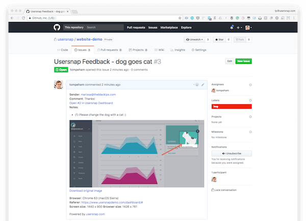

# Introduction


Submitting quality bug reports is important to get bugs fixed and to not waste developer time. Once a bug is reported, a dev will have to verify that the report is actually a bug. Once it has been verified, a dev has to hunt down the cause of the bug, and then fix it.

## Key Steps to Submit a Quality Bug Report

- Check for duplicate issues
- Strong Title
- Steps to reproduce the bug
- Only one issue per ticket
- Be detailed
- Give references
- Attached files when able
- Expected & Actual Results

### Duplicate Issues

The first step in creating a bug report is to search the bug tracker to see if the bug has already been reported. No need to report it again but if you can provide more information, add to the conversation.

!!! failure "Bad"
    Issue #121: Feature Request to Add App to Other App Stores  
    Issue #346: App isn't in F-Droid  
    Issue #987: Please add to iTunes Store & Amazon AppStore

### Strong Title

The title of the bug report is the first thing the reader sees.  It should be short and provide a quick summary of the bug.  Writing brief titles takes practice.  Start by trimming the fat – leave out unnecessary words and avoid using generic titles such as “____ is not working”.  Instead of saying what isn’t happening, say what is happening.

!!! success "Good"
    Login button leads to 404 error

!!! failure "Bad"
    Login button is not working

A strong title not only helps gain an understanding of what the bug is about, it helps reduce creating duplicate bugs by knowing that the bug already exists in the bug tracking tool.

### Steps to Reproduce the Bug

The body of the bug report should provide more detailed information and should always include the steps to reproduce the bug.  Like the title, keep this section concise, but include all necessary details.  Listing the steps in a numbered sequence makes it easy to read and comprehend.

Remember, each bug takes time to write and work through – the more lean and powerful the writing of a bug report, the quicker you can work through and resolve each bug.  Perquisites can also reduce the number of steps.  For example, instead of writing out each step to login, start the steps with “*Perquisite: user is logged in*”.  This section should also include other useful information such as browser type, device, etc.

!!! success "Good"
    1. Login
    2. press the menu button
    3. select profile...wait for page to load
    4. Click on the "*Dog*" button and you'll see a cat appear

!!! failure "Bad"
    Click on the "*Dog*" button and you'll see a cat

### Only One Issue

Please only put one issue in each issue ticket. This allows each separate issues to be worked on individually, and the ticket for each issue closed as it has been worked on. This helps team members, any 3rd party contributors, and also the ticket filer. You can use links and GitHub tools to point to other relevant tickets.

!!! success "Good"
    Login button leads to 404 error

!!! failure "Bad"
    Login button leads to 404 error & menu button causes app to freeze after getting logged in

### Be Detailed

Be as detailed as can be in the description; don’t assume familiarity with the issue.

!!! success "Good"
    I am on version 0.1.2 using a Pixel with Android 10. After I logged in and clicked the menu button in the top left, it got stuck halfway. I clicked it again to try to see the whole menu but then the screen turned black and I got "*Error: Bad Device Link*". I restarted the app and it did it again.

!!! failure "Bad"
    My menu isn't working and it's annoying.

Try to include this like version, component, platform, operation system, and severity.

!!! tip
    Use @mention individuals that you specifically want to involve in the discussion, and mention why. (“/cc @rowland007 for clarification on this logic”) or @mention teams that you want to involve in the discussion, and mention why. (“/cc @github/security, does CVE-2019XXX effect the repo?”)

### Give References

You can provide links to news articles, CVEs, or guides that may help explain your point or drive a decision.

!!! success "Good"
    The database needs to be redesigned to mitigate security vulnerabilities found in ```[CVE-2019XXX](#url-to-info)```

!!! failure "Bad"
    The database needs to be redesigned to mitigate a new found CVE

### Attachments

A picture is worth a thousand words. Take a Screenshot of the instance of failure with proper captioning to highlight the defect. Highlight unexpected error messages with light red color. This draws attention to the required area.  
If you can't get a picture, submit a log file. The log file will contain basic system information (like operating system) as well as the version of the app that is running. Frequently it also contains stack traces that can be immensely helpful in hunting down a bug.  
When able, try to provide both.



### Expected & Actual Results

A Bug description is incomplete without the Expected and Actual results. It is necessary to outline what is the outcome of the test and what the user should expect. The reader should know what the correct outcome of the test is. Clearly, mention what happened during the test and what was the outcome.

!!! success "Good"
    I clicked the "*Dog*" button expecting to see a dog appear on my profile. However, the actual result from clicking the "*Dog*" button was a cat showed up on my profile.

!!! failure "Bad"
    The button shows a cat.

## Example Bug Report :bug:

!!! example
    **Bug Name:** Application crash on clicking the SAVE button while creating a new user.  
    **Bug ID:** (It will be automatically created by the BUG Tracking tool once you save this bug)  
    **Area Path:** USERS menu > New Users  
    **Build Number:** Version Number 5.0.1  
    **Severity:** HIGH :chart_with_upwards_trend: (High/Medium/Low) or 1  
    **Priority:** HIGH :arrow_up: (High/Medium/Low) or 1  
    **Reported By:** Your Name  
    **Reported On:** Date  
    **Reason:** Defect  
    **Status:** New/Open/Active (Depends on the Tool you are using)  
    **Environment:** Windows 2003/SQL Server 2005  
    **Description:** Application crash on clicking the SAVE button while creating a new user, hence unable to create a new user in the application.  
    **Steps To Reproduce:**  
    1) Login into the Application  
    2) Navigate to the Users Menu > New User  
    3) Filled all the user information fields  
    4) Clicked on the ‘Save' button  
    5) Seen an error page “ORA1090 Exception: Insert values Error…”  
    6) See the attached logs for more information (Attach more logs related to bug..IF any)  
    7) And also see the attached screenshot of the error page.  
    **Expected Result:** On clicking SAVE button, should be prompted to a success message “New User has been created successfully”.  

    (Attach ‘application crash' screenshot. IF any)

## Conclusion

- Familiarize yourself with the context of the issue and the reasons why it exists.
- If you disagree strongly, consider giving it a few minutes before responding; think before you react.
- Avoid using derogatory terms, like “stupid”, when referring to the work someone has produced.
- Be humble. (“I’m not sure, let’s try…”)
- Avoid hyperbole. (“:x: NEVER do…”)
- Aim to develop professional skills, group knowledge and product quality, through group critique.
- Be aware of negative bias with online communication. (If content is neutral, we assume the tone is negative.) Can you use positive language as opposed to neutral?
- You may use emoji to clarify tone. [GitHub emoji list](https://gist.github.com/rxaviers/7360908)

    !!! example "Emoji Examples"
        - Can some one get some :eyes: on this please?
        - :+1: :+1: Looks good, let's get this merged!
        - :fire::fire::fire: SECURITY ALERT: App is vulnerable to CVE-2019XXX :fire::fire::fire:

- Consider leading with an expression of appreciation, especially when feedback has been mixed.
- Ask for clarification. (“I don’t understand, can you clarify?”)
- Offer clarification, explain the decisions you made to reach a solution in question.
- Try to respond to every comment.
- Link to any follow up commits, issues or Pull Requests. (“Good call! :raised_hands: Done in issue #1682851”)
- As a last resort, if there is growing confusion or debate, ask yourself if the written word is still the best form of communication. Talk (virtually) face-to-face, then mutually consider posting a follow-up to summarize any offline discussion (useful for others who be following along, now or later).
