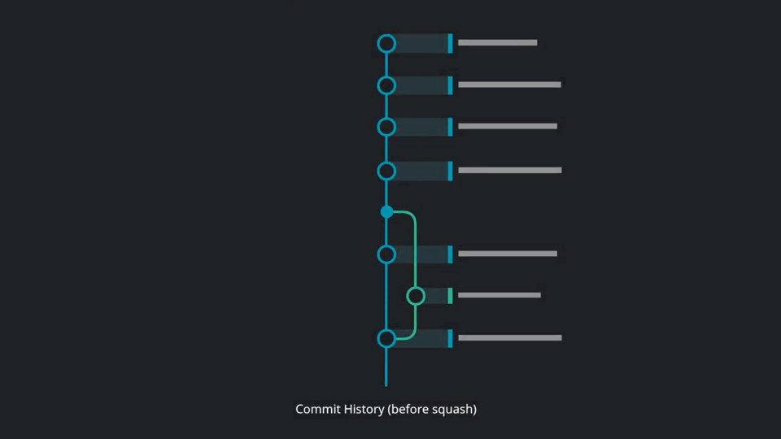

# Introduction

[](https://xkcd.com/1296/)

A project’s long-term success rests (among other things) on its maintainability, and a maintainer has few tools more powerful than his project’s log. It’s worth taking the time to learn how to care for one properly. What may be a hassle at first soon becomes habit, and eventually a source of pride and productivity for all involved.

Most programming languages have well-established conventions as to what constitutes idiomatic style, i.e. naming, formatting and so on. There are variations on these conventions, of course, but most developers agree that picking one and sticking to it is far better than the chaos that ensues when everybody does their own thing.

Reviewing others’ commits and pull requests becomes something worth doing, and suddenly can be done independently. Understanding why something happened months or years ago becomes not only possible but efficient.

Fortunately, there are well-established conventions as to what makes an idiomatic Git commit message. Indeed, many of them are assumed in the way certain Git commands function. There’s nothing you need to re-invent. Just follow the seven rules below and you’re on your way to committing like a pro.

!!! success "Requirement"
    Don't forget to sign your commits with the ```-s``` flag.

## The Seven Rules for Great Git Commit Messages

1. Separate subject from body with a blank line
2. Limit the subject line to 50 characters
3. Capitalize the subject line
4. Do not end the subject line with a period
5. Use the imperative mood in the subject line
6. Wrap the body at 72 characters
7. Use the body to explain **what** and **why** and not the *how*

Example:

```bash
Summarize changes in around 50 characters or less

More detailed explanatory text, if necessary. Wrap it to about 72
characters or so. In some contexts, the first line is treated as the
subject of the commit and the rest of the text as the body. The
blank line separating the summary from the body is critical (unless
you omit the body entirely); various tools like 'log', 'shortlog'
and 'rebase' can get confused if you run the two together.

Explain the problem that this commit is solving. Focus on why you
are making this change as opposed to how (the code explains that).
Are there side effects or other un-intuitive consequences of this
change? Here is the place to explain them.

Further paragraphs come after blank lines.

 - Bullet points are okay, too

 - Typically a hyphen or asterisk is used for the bullet, preceded
   by a single space, with blank lines in between, but conventions
   vary here

If you use an issue tracker, put references to them at the bottom,
like this:

Resolves: #123
See also: #456, #789
```

!!! info
    To read more about the 7 rules, visit [Chris Beams How to Write a Git Commit Message](https://chris.beams.io/posts/git-commit) article.

## Git Commit Message Template

A commit message template helps you write great commit messages and enforce it across teams.

You can save the template somewhere it can be accessed by all projects and saved to your git global configuration.

```bash
git config --global commit.template ~/.git-commit-template.txt
```

If you want empty commit messages (should be avoided but there might be a reason):

```bash
git config --global commit.cleanup strip
```

This prevents git from using the template as the commit message.

### git-commit-template.txt

```bash
# <type>: (If applied, this commit will...) <subject> (Max 50 char)
# |<----  Using a Maximum Of 50 Characters  ---->|


# Explain why this change is being made
# |<----   Try To Limit Each Line to a Maximum Of 72 Characters   ---->|

# Provide links or keys to any relevant tickets, articles or other resources
# Example: Github issue #23

# --- COMMIT END ---
# Type:
#    feat     (new feature)
#    fix      (bug fix)
#    refactor (refactoring production code)
#    style    (formatting, missing semi colons, etc; no code change)
#    docs     (changes to documentation)
#    test     (adding or refactoring tests; no production code change)
#    chore    (updating grunt tasks etc; no production code change)
# --------------------
# Remember to
#    1. Separate subject from body with a blank line
#    2. Limit the subject line to 50 characters
#    3. Capitalize the subject line
#    4. Do not end the subject line with a period
#    5. Use the imperative mood in the subject line
#    6. Wrap the body at 72 characters
#    7. Use the body to explain what and why and not the how
# --------------------
# For more information about this template, check out
# https://gist.github.com/adeekshith/cd4c95a064977cdc6c50
```

## Squashing Commits



### Using Rebase

The ```rebase``` command has some awesome options available in its ```--interactive``` (or ```-i```) mode, and one of the most widely used is the ability to squash commits. What this does is take smaller commits and combine them into larger ones, which could be useful if you’re wrapping up the day’s work or if you just want to package your changes differently. We’re going to go over how you can do this easily. 

!!! caution
    Only do this on commits that haven’t been pushed an external repository. If others have based work off of the commits that you’re going to delete, plenty of conflicts can occur. Just don’t rewrite your history if it’s been shared with others.

So let’s say you’ve just made a few small commits, and you want to make one larger commit out of them. Our repository’s history currently looks like this:

[](https://blog.axosoft.com/learning-git-gitkraken-squash-commits/)

The last 4 commits would be much happier if they were wrapped up together, so let’s do just that through interactive rebasing:

```bash
$ git rebase -i HEAD~4

pick 01d1124 Adding license
pick 6340aaa Moving license into its own file
pick ebfd367 Jekyll has become self-aware.
pick 30e0ccb Changed the tagline in the binary, too.

# Rebase 60709da..30e0ccb onto 60709da
#
# Commands:
#  p, pick = use commit
#  e, edit = use commit, but stop for amending
#  s, squash = use commit, but meld into previous commit
#
# If you remove a line here THAT COMMIT WILL BE LOST.
# However, if you remove everything, the rebase will be aborted.
#
```

So, a few things have happened here. First of all, I told Git that I wanted to rebase using the last four commits from where the ```HEAD``` is with ```HEAD~4```. So if you had 19 commits, it would be ```HEAD~19```. Git has now put me into an editor with the above text in it, and a little explanation of what can be done. You have plenty of options available to you from this screen, but right now we’re just going to squash everything into one commit. So, changing the first four lines of the file to this will do the trick:

```bash
pick 01d1124 Adding license
squash 6340aaa Moving license into its own file
squash ebfd367 Jekyll has become self-aware.
squash 30e0ccb Changed the tagline in the binary, too.
```

Basically this tells Git to combine all four commits into the the first commit in the list. Once this is done and saved, another editor pops up with the following:

```bash
# This is a combination of 4 commits.
# The first commit's message is:
Adding license

# This is the 2nd commit message:

Moving license into its own file

# This is the 3rd commit message:

Jekyll has become self-aware.

# This is the 4th commit message:

Changed the tagline in the binary, too.

# Please enter the commit message for your changes. Lines starting
# with '#' will be ignored, and an empty message aborts the commit.
# Explicit paths specified without -i nor -o; assuming --only paths...
# Not currently on any branch.
# Changes to be committed:
#   (use "git reset HEAD <file>..." to unstage)
#
#	new file:   LICENSE
#	modified:   README.textile
#	modified:   Rakefile
#	modified:   bin/jekyll
#
```

Since we’re combining so many commits, Git allows you to modify the new commit’s message based on the rest of the commits involved in the process. Edit the message as you see fit, then save and quit. Once that’s done, your commits have been successfully squashed!

```bash
Created commit 0fc4eea: Creating license file, and making jekyll self-aware.
 4 files changed, 27 insertions(+), 30 deletions(-)
  create mode 100644 LICENSE
	Successfully rebased and updated refs/heads/master.
```

And if we look at the history again...


So, this has been a relatively painless so far. If you run into conflicts during the rebase, they’re usually quite easy to resolve and Git leads you through as much as possible. The basics of this is fix the conflict in question, ```git add``` the file, and then ```git rebase --continue``` will resume the process. Of course, doing a ```git rebase --abort``` will bring you back to your previous state if you want. If for some reason you’ve lost a commit in the rebase, you can use the ```reflog``` to get it back.

!!! info
    Based on the article written by Nick Quaranto [Squashing Commits with Rebase](http://gitready.com/advanced/2009/02/10/squashing-commits-with-rebase.html)
