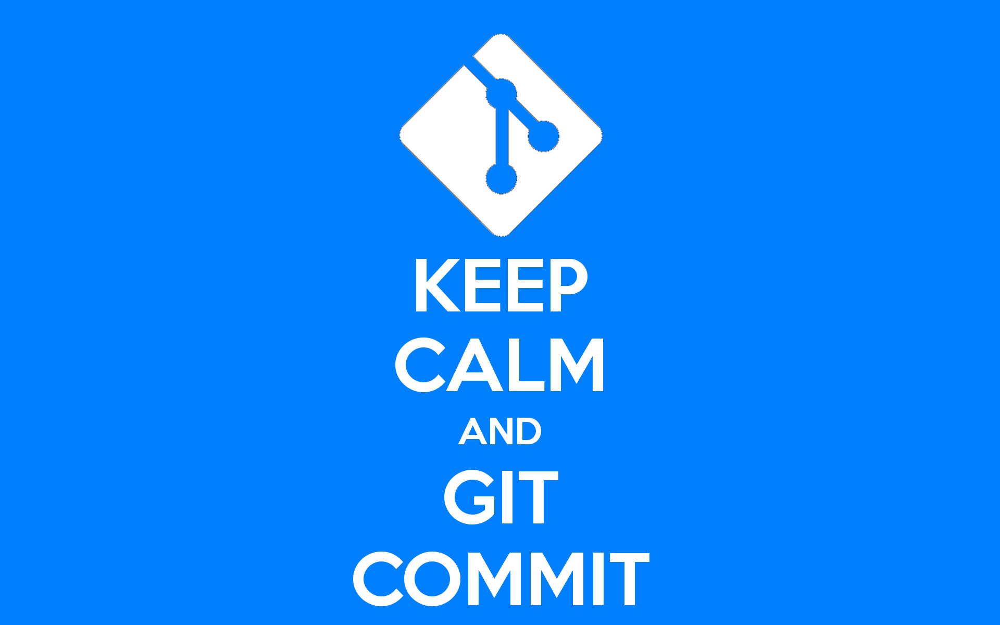

# Introduction

[](https://xkcd.com/1296/)

A project’s long-term success rests (among other things) on its maintainability, and a maintainer has few tools more powerful than his project’s log. It’s worth taking the time to learn how to care for one properly. What may be a hassle at first soon becomes habit, and eventually a source of pride and productivity for all involved.

Most programming languages have well-established conventions as to what constitutes idiomatic style, i.e. naming, formatting and so on. There are variations on these conventions, of course, but most developers agree that picking one and sticking to it is far better than the chaos that ensues when everybody does their own thing.

Reviewing others’ commits and pull requests becomes something worth doing, and suddenly can be done independently. Understanding why something happened months or years ago becomes not only possible but efficient.

Fortunately, there are well-established conventions as to what makes an idiomatic Git commit message. Indeed, many of them are assumed in the way certain Git commands function. There’s nothing you need to re-invent. Just follow the seven rules below and you’re on your way to committing like a pro but don't forget to sign your commits with the ```-s``` flag.

## The Seven Rules for Great Git Commit Messages

1. Separate subject from body with a blank line
2. Limit the subject line to 50 characters
3. Capitalize the subject line
4. Do not end the subject line with a period
5. Use the imperative mood in the subject line
6. Wrap the body at 72 characters
7. Use the body to explain **what** and **why** and not the *how*

Example:

```bash
Summarize changes in around 50 characters or less

More detailed explanatory text, if necessary. Wrap it to about 72
characters or so. In some contexts, the first line is treated as the
subject of the commit and the rest of the text as the body. The
blank line separating the summary from the body is critical (unless
you omit the body entirely); various tools like 'log', 'shortlog'
and 'rebase' can get confused if you run the two together.

Explain the problem that this commit is solving. Focus on why you
are making this change as opposed to how (the code explains that).
Are there side effects or other un-intuitive consequences of this
change? Here is the place to explain them.

Further paragraphs come after blank lines.

 - Bullet points are okay, too

 - Typically a hyphen or asterisk is used for the bullet, preceded
   by a single space, with blank lines in between, but conventions
   vary here

If you use an issue tracker, put references to them at the bottom,
like this:

Resolves: #123
See also: #456, #789
```

To read more about the 7 rules, visit [Chris Beams How to Write a Git Commit Message](https://chris.beams.io/posts/git-commit) article.

## Git Commit Message Template

A commit message template helps you write great commit messages and enforce it across teams.

You can save the template somewhere it can be accessed by all projects and saved to your git global configuration.

```bash
git config --global commit.template ~/.git-commit-template.txt
```

If you want empty commit messages (should be avoided but there might be a reason):

```bash
git config --global commit.cleanup strip
```

This prevents git from using the template as the commit message.

### git-commit-template.txt

```bash
# <type>: (If applied, this commit will...) <subject> (Max 50 char)
# |<----  Using a Maximum Of 50 Characters  ---->|


# Explain why this change is being made
# |<----   Try To Limit Each Line to a Maximum Of 72 Characters   ---->|

# Provide links or keys to any relevant tickets, articles or other resources
# Example: Github issue #23

# --- COMMIT END ---
# Type:
#    feat     (new feature)
#    fix      (bug fix)
#    refactor (refactoring production code)
#    style    (formatting, missing semi colons, etc; no code change)
#    docs     (changes to documentation)
#    test     (adding or refactoring tests; no production code change)
#    chore    (updating grunt tasks etc; no production code change)
# --------------------
# Remember to
#    1. Separate subject from body with a blank line
#    2. Limit the subject line to 50 characters
#    3. Capitalize the subject line
#    4. Do not end the subject line with a period
#    5. Use the imperative mood in the subject line
#    6. Wrap the body at 72 characters
#    7. Use the body to explain what and why and not the how
# --------------------
# For more information about this template, check out
# https://gist.github.com/adeekshith/cd4c95a064977cdc6c50
```


