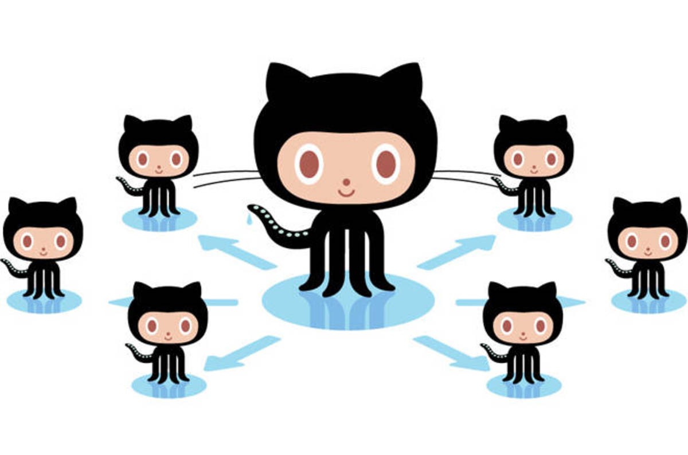

# Forking

A *fork* is a copy of a repository. Forking a repository allows you to freely experiment with changes without affecting the original project.



A great example of using forks to propose changes is for bug fixes. Rather than logging an issue for a bug you've found. You can:

- Fork the repo
- Make the fix
- Submit a *pull request* for the project

If I like you're work and it meets the Code Style Guidelines, I might pull your fix into the original repository!

## Fork the Repo

1. Navigate to the project's repository on GitHub
2. In the top-right corner of the page, click ```Fork```
    

## Keeping your fork synced

You might fork a project in order to propose changes to the *upstream*, or original, repository. In this case, it's good practice to regularly sync your fork with the upstream repository.

!!! info
    The following is based on an article by [Chris Simpkins](https://medium.com/sweetmeat/how-to-keep-a-downstream-git-repository-current-with-upstream-repository-changes-10b76fad6d97).

### The Problem

A *downstream* repo (aka the "fork") you just made commonly needs to stay current with the *upstream* work (aka the original repo). The following steps allow you to achieve this.

### Add the Remote Upstream Repo

This step defines the upstream repo of *your* fork. Replace the ```<URL.git>``` with the original repo's URL without the <&nbsp;>.

```bash
git remote add upstream <URL.git>
```


### Getting the latest Upstream Changes

You will want to run this command the first time you add the *upstream* repo. This will ensure you are connected to the repo correctly.

```bash
git remote -v
```

This will show you something like the following:

```bash
> origin    https://github.com/YOUR_USERNAME/YOUR_FORK.git (fetch)
> origin    https://github.com/YOUR_USERNAME/YOUR_FORK.git (push)
> upstream  https://github.com/rowland007/ORIGINAL_REPOSITORY.git (fetch)
> upstream  https://github.com/rowland007/ORIGINAL_REPOSITORY.git (push)
```

 After you verify you're connected you can get the branches you'll be working with. You will also use this command to stay up-to-date with the upstream repo. I suggest running this command each time you open the project before you start making changes. This will ensure you're on the latest changes.

```bash
git fetch upstream
```

### Merging Upstream changes into your Downstream Repo

From your ```develop``` branch, use the following merge command to merge the *upstream* ```develop``` branch changes into your local source:

```bash
git merge -S upstream/develop
```

Very rarely will my projects not have a ```develop``` branch (usually my websites like this one). When there is a ```develop``` branch, no work should take place from the ```master``` branch.


!!! tip
    Big take away here is:

    - *upstream* & *original* means they are mine
    - *downstream*, *fork*, and *origin* are yours

See the next section about creating a new branch for your work.
