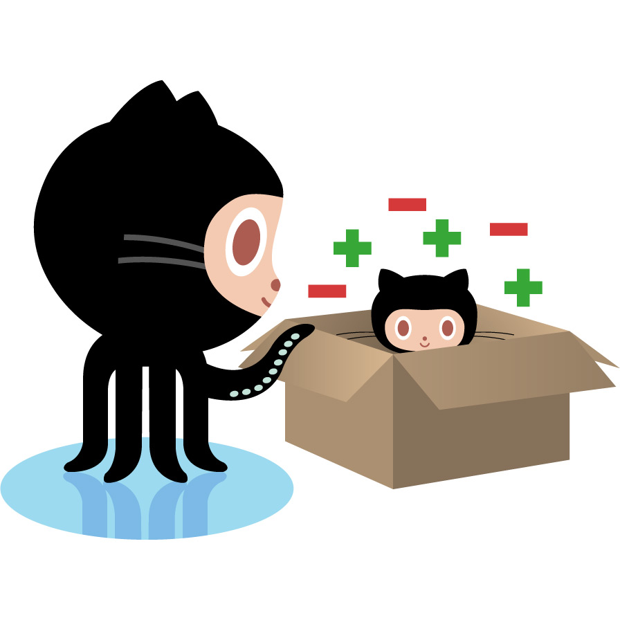

# Introduction

Want to contribute to my project but never used git before? Maybe you just need a refresher? Or if you just want to know how I would like my projects done? This guide is for you!

All contributions to the source code **must** be cryptographically signed by the author’s PGP key or GitHub's key.

## Notice

This page is always a work in progress. It gets updated when I learn new tricks or when there's a more secure way of doing things. If you notice any errors or have trouble with a way I am doing things, please feel free to contact me via my website: [randyrowland.me](https://randyrowland.me/#contact). You may also create a pull request for this guide.

Be sure to checkout the Style Guide to save yourself headaches during a pull request.

## Table of Contents

- [Forking the Project](fork.md)
- [Branches](../static/page/construction.md)
- [Code Signing (External Website)](https://www.qubes-os.org/doc/code-signing/)
- [Committing](../static/page/construction.md)
- [Pull Request](../static/page/construction.md)
