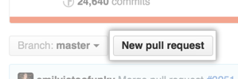

# Submitting Changes

Pull requests let you tell others about changes you've pushed to a branch in a repository. Once a pull request is opened, you can discuss and review the potential changes with collaborators and add follow-up commits before your changes are merged into the base branch.

!!! tip
    If you have a lot of commits, squash them into a single commit.

!!! tip
    Recommend that you use a topic branch for your pull request. While you can send pull requests from any branch or commit, with a topic branch you can push follow-up commits if you need to update your proposed changes.

!!! danger
    When pushing commits to a pull request, don't force push. Force pushing can corrupt your pull request.

## Creating the Pull Request

1. On GitHub, navigate to the main page of the repository.
2. In the "Branch" menu, choose the branch that contains **your** commits.

    !!! note
        More than likely, you will choose your ```feature/``` branch.

3. Look for the **New pull request** button.

    

4. Use the base branch dropdown menu to select the branch you'd like to merge your changes into, then use the compare branch drop-down menu to choose the topic branch you made your changes in.

    !!! note
        More than likely, you will choose the ```develop``` branch. You are asking to add your ```feature/``` branch into ```develop```.

    

5. Type a title and description for your pull request. For more details on writing a good pull requests, see [Writing the Pull Request](#writing-the-pull-request) section below.

    !!! tip
        Describe the pull request's impact on the project in the title. Like the commits type, you can use keywords at the beginning of the title to signify what the what you want the pull request to do:

        ```Added``` - for new features.  
        ```Changed``` - for changes in existing functionality.  
        ```Deprecated``` - for once-stable features removed in upcoming releases.  
        ```Removed``` - for deprecated features removed in this release.  
        ```Fixed``` - for any bug fixes.  
        ```Security``` - to invite users to upgrade in case of vulnerabilities.  
        ```[WIP]``` - DO NOT USE in ```master``` branch

6. To create a pull request that is ready for review, click Create Pull Request. To create a draft pull request, use the drop-down and select Create Draft Pull Request, then click Draft Pull Request.

    !!! info
        For more information about draft pull requests, see GitHub's [About pull requests](https://help.github.com/en/github/collaborating-with-issues-and-pull-requests/about-pull-requests#draft-pull-requests)

    

## Writing the Pull Request

After you open a pull request in a repository, collaborators or team members can comment on the comparison of files between the two specified branches, or leave general comments on the project as a whole.

The title should state the overall impact to the project such as, ```Added a button to the <blah> interface```, ```Removed unused code```, ```Security: patched CVE-2019XXX```, or ```Fixed gh issue #243```.

Include the purpose of this Pull Request in the description. For example: *This is a spike to explore…*, *This simplifies the display of…*, *This fixes handling of…*  Within the description, consider providing an overview of why the work is taking place (with any relevant links); don’t assume familiarity with the history.

!!! tip
    Remember that anyone could be reading this Pull Request, so the content and tone may inform people other than those taking part, now or later. Explain the what and why and not the how.

Be explicit about what feedback you want, if any: a quick pair of eyes on the code, discussion on the technical approach, critique on design, a review of copy. Be explicit about when you want feedback, if the Pull Request is work in progress, say so. A prefix of “`[WIP]`” in the title is a simple, common pattern to indicate that state. ```WIP``` should be limited but maybe you got stuck and need some help or you want to ensure you are heading in the right direction with the feature.

!!! fail "Avoid"
    ```WIP``` should never be requested into the ```master``` branch

Use @mention individuals that you specifically want to involve in the discussion, and mention why. (“/cc @rowland007 for clarification on this logic”) or @mention teams that you want to involve in the discussion, and mention why. (“/cc @github/security, any concerns with this approach?”)

### Offering feedback

- Familiarize yourself with the context of the issue, and reasons why this Pull Request exists.
- If you disagree strongly, consider giving it a few minutes before responding; think before you react.
- Ask, don’t tell. (“What do you think about trying…?” rather than “Don’t do…”)
- Explain your reasons why code should be changed. (Not in line with the style guide? A personal preference?)
- Offer ways to simplify or improve code.
- Avoid using derogatory terms, like “stupid”, when referring to the work someone has produced.
- Be humble. (“I’m not sure, let’s try…”)
- Avoid hyperbole. (“NEVER do…”)
- Aim to develop professional skills, group knowledge and product quality, through group critique.
- Be aware of negative bias with online communication. (If content is neutral, we assume the tone is negative.) Can you use positive language as opposed to neutral?
- You may use emoji to clarify tone. [GitHub emoji list](https://gist.github.com/rxaviers/7360908)

### Responding to feedback

- Consider leading with an expression of appreciation, especially when feedback has been mixed.
- Ask for clarification. (“I don’t understand, can you clarify?”)
- Offer clarification, explain the decisions you made to reach a solution in question.
- Try to respond to every comment.
- Link to any follow up commits or Pull Requests. (“Good call! Done in issue #1682851”)
- As a last resort, if there is growing confusion or debate, ask yourself if the written word is still the best form of communication. Talk (virtually) face-to-face, then mutually consider posting a follow-up to summarize any offline discussion (useful for others who be following along, now or later).
