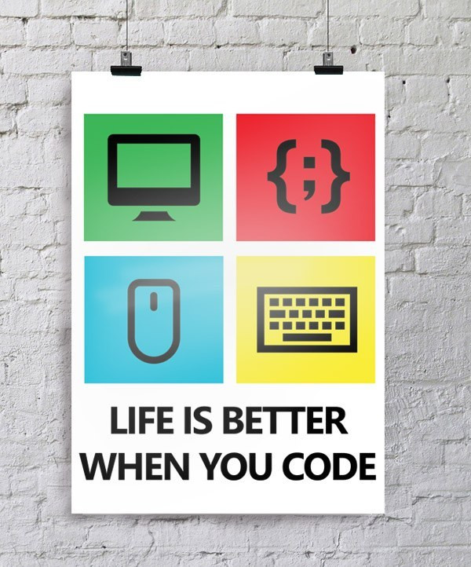

# Contributing to Projects

[Pull requests](#), [bug reports](#), and questions are always welcome. If you feel like contributing financially, please see my [donation](https://randyrowland.me/donations/) page.

- See each projects *build* page on how to build the specific project
- The [Contributing](https://rowland007.github.io/Contributing/contribute/) specifies how to use Git and Github with the projects
- The [Code Style Guide](https://rowland007.github.io/Contributing/style-guide/) shows how to import files, use classes, methods, and variable names

