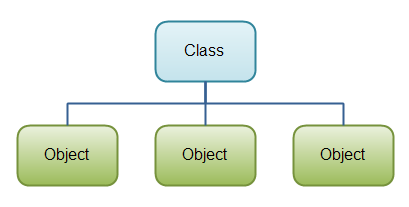

## Introduction



!!! info
    This is based on [Ryan McDermott's clean-code-javascript](https://github.com/ryanmcdermott/clean-code-javascript#functions) that was written in December 2016. Some of the principles may be very JavaScript specific. Most of the principles will apply to all languages.

### Naming

Class names are written in UpperCamelCase. Class names are typically nouns or noun phrases. For example, ```Character``` or ```ImmutableList```. Interface names may also be nouns or noun phrases (for example, ```List```), but may sometimes be adjectives or adjective phrases instead (for example, ```Readable```). There are no specific rules or even well-established conventions for naming annotation types. Test classes are named starting with the name of the class they are testing, and ending with ```Test```. For example, ```HashTest``` or ```HashIntegrationTest```.

!!! failure "Bad"
    ```javascript
    my_crappy_class
    MY_CRAPPY_CLASS
    TestingFunctions
    ```

!!! success "Good"
    ```javascript
    PlayableCharacter
    ControllerTest
    Car
    ```

## Prefer ES2015/ES6 classes over ES5 plain functions

It's very difficult to get readable class inheritance, construction, and method
definitions for classical ES5 classes. If you need inheritance (and be aware
that you might not), then prefer ES2015/ES6 classes. However, prefer small functions over
classes until you find yourself needing larger and more complex objects.

!!! failure "Bad"
    ```javascript
    const Animal = function(age) {
        if (!(this instanceof Animal)) {
            throw new Error("Instantiate Animal with `new`");
        }

        this.age = age;
    };

    Animal.prototype.move = function move() {};

    const Mammal = function(age, furColor) {
        if (!(this instanceof Mammal)) {
        throw new Error("Instantiate Mammal with `new`");
    }

    Animal.call(this, age);
        this.furColor = furColor;
    };

    Mammal.prototype = Object.create(Animal.prototype);
    Mammal.prototype.constructor = Mammal;
    Mammal.prototype.liveBirth = function liveBirth() {};

    const Human = function(age, furColor, languageSpoken) {
        if (!(this instanceof Human)) {
            throw new Error("Instantiate Human with `new`");
        }

        Mammal.call(this, age, furColor);
        this.languageSpoken = languageSpoken;
    };

    Human.prototype = Object.create(Mammal.prototype);
    Human.prototype.constructor = Human;
    Human.prototype.speak = function speak() {};
    ```

!!! success "Good"
    ```javascript
    class Animal {
        constructor(age) {
            this.age = age;
        }

        move() {
            /* ... */
        }
    }

    class Mammal extends Animal {
        constructor(age, furColor) {
            super(age);
            this.furColor = furColor;
        }

        liveBirth() {
            /* ... */
        }
    }

    class Human extends Mammal {
        constructor(age, furColor, languageSpoken) {
            super(age, furColor);
            this.languageSpoken = languageSpoken;
        }

        speak() {
            /* ... */
        }
    }
    ```

## Use method chaining

This pattern is very useful in JavaScript and you see it in many libraries such
as jQuery and Lodash. It allows your code to be expressive, and less verbose.
For that reason, I say, use method chaining and take a look at how clean your code
will be. In your class functions, simply return `this` at the end of every function,
and you can chain further class methods onto it.

!!! failure "Bad"
    ```javascript
    class Car {
        constructor(make, model, color) {
            this.make = make;
            this.model = model;
            this.color = color;
        }

        setMake(make) {
            this.make = make;
        }

        setModel(model) {
            this.model = model;
        }

        setColor(color) {
            this.color = color;
        }

        save() {
            console.log(this.make, this.model, this.color);
        }
    }

    const car = new Car("Ford", "F-150", "red");
    car.setColor("pink");
    car.save();
    ```

!!! success "Good"
    ```javascript
    class Car {
        constructor(make, model, color) {
            this.make = make;
            this.model = model;
            this.color = color;
        }

        setMake(make) {
            this.make = make;
            // NOTE: Returning this for chaining
            return this;
        }

        setModel(model) {
            this.model = model;
            // NOTE: Returning this for chaining
            return this;
        }

        setColor(color) {
            this.color = color;
            // NOTE: Returning this for chaining
            return this;
        }

        save() {
            console.log(this.make, this.model, this.color);
            // NOTE: Returning this for chaining
            return this;
        }
    }

    const car = new Car("Ford", "F-150", "red").setColor("pink").save();
    ```

## Prefer composition over inheritance

As stated famously in [_Design Patterns_](https://en.wikipedia.org/wiki/Design_Patterns) by the Gang of Four,
you should prefer composition over inheritance where you can. There are lots of
good reasons to use inheritance and lots of good reasons to use composition.
The main point for this maxim is that if your mind instinctively goes for
inheritance, try to think if composition could model your problem better. In some
cases it can.

You might be wondering then, "when should I use inheritance?" It
depends on your problem at hand, but this is a decent list of when inheritance
makes more sense than composition:

1. Your inheritance represents an "is-a" relationship and not a "has-a"
   relationship (Human->Animal vs. User->UserDetails).
2. You can reuse code from the base classes (Humans can move like all animals).
3. You want to make global changes to derived classes by changing a base class.
   (Change the caloric expenditure of all animals when they move).

!!! failure "Bad"
    ```javascript
    class Employee {
        constructor(name, email) {
            this.name = name;
            this.email = email;
        }
        // ...
    }

    // Bad because Employees "have" tax data. EmployeeTaxData is not a type of Employee
    class EmployeeTaxData extends Employee {
        constructor(ssn, salary) {
            super();
            this.ssn = ssn;
            this.salary = salary;
        }
        // ...
    }
    ```

!!! success "Good"
    ```javascript
    class EmployeeTaxData {
        constructor(ssn, salary) {
            this.ssn = ssn;
            this.salary = salary;
        }
        // ...
    }

    class Employee {
        constructor(name, email) {
            this.name = name;
            this.email = email;
        }

        setTaxData(ssn, salary) {
            this.taxData = new EmployeeTaxData(ssn, salary);
        }
        // ...
    }
    ```
