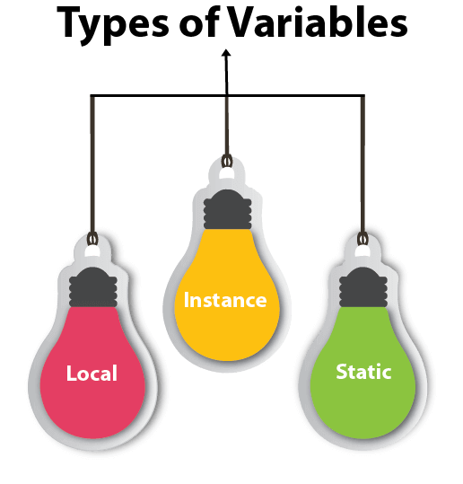

## Introduction



!!! info
    This is based on [Ryan McDermott's clean-code-javascript](https://github.com/ryanmcdermott/clean-code-javascript#functions) that was written in December 2016. Some of the principles may be very JavaScript specific. Most of the principles will apply to all languages.

### Naming

Variables use lowerCamelCase and constant names use CONSTANT_CASE. All the rest of the principles below can apply to constants as well as long as they're written in CONSTANT_CASE.

!!! failure "Bad"
    === "Variables"
        ```javascript
        CURRENT_DATE
        var_123
        var123
        TestThisVar
        ```
    === "Constants"
        ```javascript
        currentDate
        constant
        TestThisConst
        ```

!!! success "Good"
    === "Variables"
        ```javascript
        currentDate
        mutableValues
        blastOffTime
        streetAddress
        ```
    === "Constants"
        ```javascript
        MAX_NUMBER
        SPEED_OF_LIGHT
        GOLDEN_RATIO
        ```

!!! warning
    When naming a variable after an acronym, like ATM, ISP, ID. Only the first letter is still capitalized and the rest are lower.

    !!! failure "Bad"
        ```javascript
        cashLeftInATM
        newCustomerID
        ```

    !!! success "Good"
        ```javascript
        cashLeftInAtm
        NewCustomerId
        ```

## Use meaningful and pronounceable names

!!! failure "Bad"
    ```javascript
    const yyyymmdstr = moment().format("YYYY/MM/DD");
    ```

!!! success "Good"
    ```javascript
    const currentDate = moment().format("YYYY/MM/DD");
    ```

## Use the same vocabulary for the same type of variable

!!! failure "Bad"
    ```javascript
    getUserInfo();  
    getClientData();  
    getCustomerRecord();
    ```

!!! success "Good"
    ```javascript
    getUser();
    ```

## Use searchable names

We will read more code than we will ever write. It's important that the code we
do write is readable and searchable. By _not_ naming variables that end up
being meaningful for understanding our program, we hurt our readers.
Make your names searchable. Tools like
[buddy.js](https://github.com/danielstjules/buddy.js) and
[ESLint](https://github.com/eslint/eslint/blob/660e0918933e6e7fede26bc675a0763a6b357c94/docs/rules/no-magic-numbers.md)
can help identify unnamed constants.

!!! failure "Bad"
    ```javascript
    // What the heck is 86400000 for?  
    setTimeout(blastOff, 86400000);

    ```

!!! success "Good"
    ```javascript
    // Declare them as capitalized named constants.  
    const MILLISECONDS_IN_A_DAY = 86400000;

    setTimeout(blastOff, MILLISECONDS_IN_A_DAY);
    ```

## Use explanatory variables

!!! failure "Bad"
    ```javascript
    const address = "One Infinite Loop, Cupertino 95014";  
    const cityZipCodeRegex = /^[^,\\]+[,\\\s]+(.+?)\s*(\d{5})?$/;  
    saveCityZipCode(  
        address.match(cityZipCodeRegex)[1],  
        address.match(cityZipCodeRegex)[2]
    );
    ```

!!! success "Good"
    ```javascript
    const address = "One Infinite Loop, Cupertino 95014";  
    const cityZipCodeRegex = /^[^,\\]+[,\\\s]+(.+?)\s*(\d{5})?$/;  
    const [, city, zipCode] = address.match(cityZipCodeRegex) || [];  
    saveCityZipCode(city, zipCode);
    ```

## Avoid Mental Mapping

Explicit is better than implicit.

!!! failure "Bad"
    ```javascript
    const locations = ["Austin", "New York", "San Francisco"];  
    locations.forEach(`l` => {  
        doStuff();  
        doSomeOtherStuff();  
        // ...  
        // ...  
        // ...  
        // Wait, what is `l` for again?  
        dispatch(l);  
    });

    ```

!!! success "Good"
    ```javascript
    const locations = ["Austin", "New York", "San Francisco"];  
    locations.forEach(location => {  
        doStuff();  
        doSomeOtherStuff();  
        // ...  
        // ...  
        // ...  
        dispatch(location);  
    });
    ```

## Don't add unneeded context

If your class/object name tells you something, don't repeat that in your
variable name.

!!! failure "Bad"
    ```javascript
    const Car = {  
        carMake: "Honda",  
        carModel: "Accord",  
        carColor: "Blue"
    };

    function paintCar(car) {  
        car.carColor = "Red";
    }
    ```

!!! success "Good"
    ```javascript
    const Car = {  
        make: "Honda",  
        model: "Accord",  
        color: "Blue"  
    };

    function paintCar(car) {  
        car.color = "Red";  
    }
    ```

## Use default arguments instead of short circuiting or conditionals

Default arguments are often cleaner than short circuiting. Be aware that if you
use them, your function will only provide default values for `undefined`
arguments. Other "falsy" values such as `''`, `""`, `false`, `null`, `0`, and
`NaN`, will not be replaced by a default value.

!!! failure "Bad"
    ```javascript
    function createMicrobrewery(name) {  
        const breweryName = name || "Hipster Brew Co.";  
        // ...  
    }
    ```

!!! success "Good"
    ```javascript
    function createMicrobrewery(name = "Hipster Brew Co.") {  
        // ...  
    }
    ```
